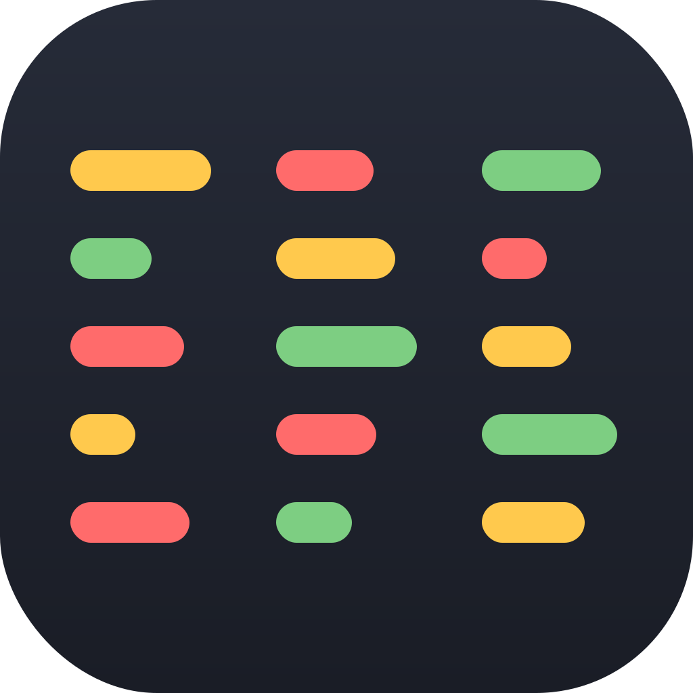

<table border="0" cellpadding="0" cellspacing="0">
<tr>
<td width="180" valign="top">

</td>
<td valign="top">

# Subtitle Compare

Windows app for comparing subtitle tracks inside an MKV (or similar container). Drop a file on the window, pick up to three tracks, and compare them side by side.

</td>
</tr>
</table>

## Features

- **Three compare panes.** Each column has its own track dropdown, including `(none)` so you can compare two tracks or look at one alone.
- **Drop or Open.** Accepts `.mkv`, `.mka`, `.mks`, `.mp4`, and `.m4v`. `Ctrl+O` opens a file picker.
- **Timestamp alignment.** Cues are lined up by overlapping start/end times, not by cue number, so tracks that split lines differently still sit on the same row.
- **Word-level diffs.** Shared wording stays plain. Changed words are highlighted, wording unique to one track is marked, and a missing cue shows a muted “no cue” row instead of a loud empty hole.
- **Key.** Button next to About. Opens a little legend for those compare colors — same, changed, only here, and the muted no-cue row.
- **Jump differences.** Previous / Next difference buttons, plus `F7` / `F8`.
- **Synced scrolling.** All three columns move together.
- **SDH.** If a track looks like SDH, a small note shows up under its dropdown:
  - hearing-impaired flag and/or an SDH-style title (`SDH subtitle track (determined from track title & flag)`, or title-only / flag-only)
  - otherwise a text scan for a lot of `[brackets]`, `(parentheses)`, or music notes (`Potential SDH subtitle track detected`)
- **Forced.** Same idea for forced tracks (`Forced subtitle track (determined from track flag)`, and so on). A track can be both SDH and forced.
- **Light and dark.** Sun/moon button next to About toggles Light/Dark, overrides the OS, and persists in `%LOCALAPPDATA%\SubtitleCompare\theme.txt`. First run follows Windows until you click.
- **In-app updates.** On launch (and from About → Check for updates) the app offers to download the new exe and restart.
- **Image-track OCR.** PGS (Blu-ray) tracks are OCR'd on device with Tesseract and then compared like any text track. The first time a language is used, the app downloads that trained data into `%LOCALAPPDATA%\SubtitleCompare\tessdata`. Results can be imperfect, especially with stylized or outlined fonts. VobSub and DVB are still image-only.
- **Busy status.** While a column is extracting, parsing, or OCR'ing, the bottom bar names the busy panes (A/B/C) and a combined percent when those columns have real totals. Idle stays the short row/diff count.

Vibe coded by [Andy Rostad](https://github.com/arostad). Released under the [MIT License](LICENSE).

## Requirements

`ffmpeg` and `ffprobe` must be on PATH. If a new PC does not have them:

```
winget install Gyan.FFmpeg
```

The app also pops a dialog if FFmpeg is missing, with an Install FFmpeg button (opens a visible winget console) and a copyable command. Then open a new PowerShell window or restart the app if PATH did not refresh.

## Fresh Windows install

In PowerShell, save the installer, then run it (do not pipe the script):

```
irm https://raw.githubusercontent.com/arostad/SubtitleCompare/main/scripts/Install-SubtitleCompare.ps1 -OutFile $env:TEMP\Install-SubtitleCompare.ps1
```

```
powershell -NoProfile -ExecutionPolicy Bypass -File $env:TEMP\Install-SubtitleCompare.ps1
```

That downloads `SubtitleCompare.exe` (about 140 MB) to `%LOCALAPPDATA%\SubtitleCompare` and creates Desktop and Start Menu shortcuts.

Or grab `SubtitleCompare.exe` from the [Latest release](https://github.com/arostad/SubtitleCompare/releases/tag/latest) yourself.

## Updates

After the first install, use **Update** in the app when it says a new version is available. You do not move the exe by hand.

## Use

Drop an `.mkv` (or Open…). Each pane picks a subtitle track. PGS image tracks are OCR'd (first use may download language data). `F7` / `F8` jump differences.
